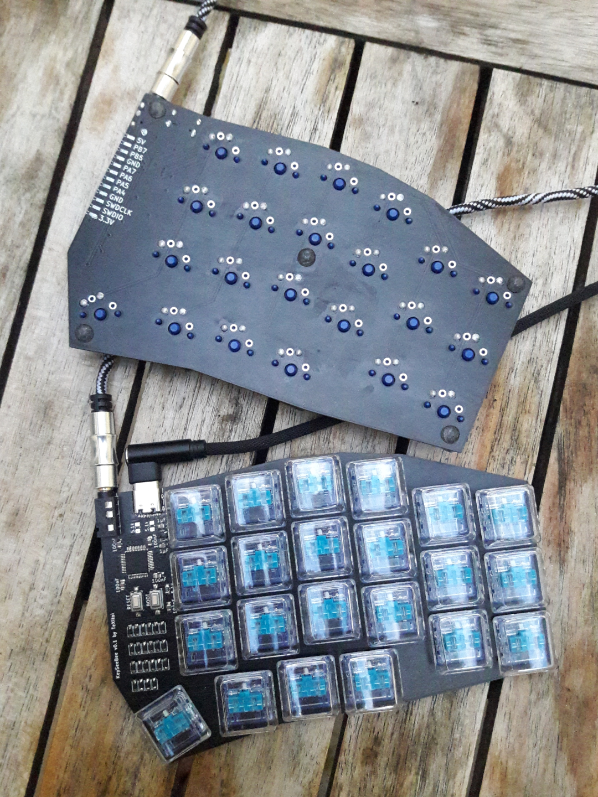

# KeySeeBee


KeySeeBee is a split ergo keyboard. It is only 2 PCB (so the name)
with (almost) only SMD components on it. It's only a keyboard, no LED,
no display, nothing more than keys and USB.

The firmware is [Keyberon](https://github.com/TeXitoi/keyberon), a
pure rust firmware.

## Features

 * 44 keys, using Cherry MX or Kailh choc switches, only 1U keycaps;
 * USB-C connector on the 2 sides;
 * TRRS cable for connecting the 2 halves (for power and UART communication between the 2 halves);
 * 2 STM32F072 MCU, with hardware USB DFU bootloader and crystal less USB;
 * Only onboard SMD component (except for the switches and TRRS connector).

## Inspiration

 * [Plaid](https://github.com/hsgw/plaid) for "show the components"
 * [GergoPlex](https://www.gboards.ca/product/gergoplex) for "just a keyboard" and "only a PCB with SMD components"
 * [Lily58](https://github.com/kata0510/Lily58) for the thumb cluster
 * [Kyria](https://blog.splitkb.com/blog/introducing-the-kyria) for
   "don't be affraid of pinky stagger"

## Gallery




## Compiling and flashing

Install the complete toolchain and utils:

```shell
curl https://sh.rustup.rs -sSf | sh
rustup target add thumbv6m-none-eabi
rustup component add llvm-tools-preview
cargo install cargo-binutils
sudo apt-get install dfu-util
```

Compile:

```shell
cd firmware
cargo objcopy --bin keyseebee --release -- -O binary keyseebee.bin
```

To flash using dfu-util, first put the board in dfu mode by pressing
BOOT, pressing and releasing RESET and releasing BOOT. Then:

```shell
dfu-util -d 0483:df11 -a 0 -s 0x08000000:leave -D keyseebee.bin
```

The fist time, if the write fail, your flash might be protected. To
unprotect:

```shell
dfu-util -d 0483:df11 -a 0 -s 0x08000000:force:unprotect -D keyseebee.bin
```
